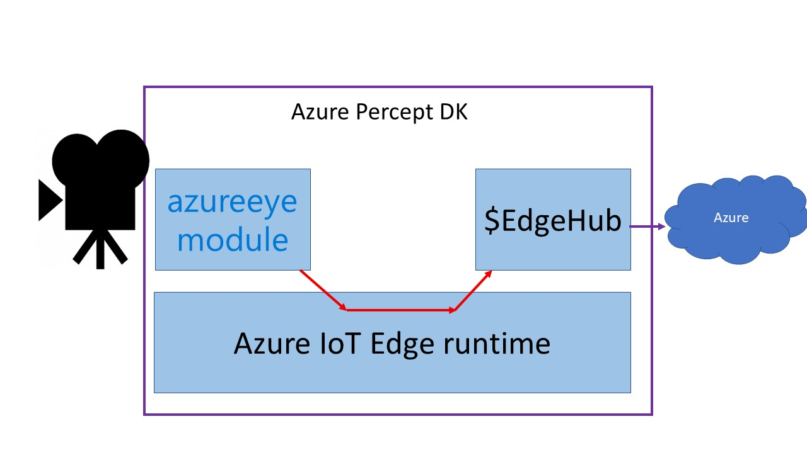
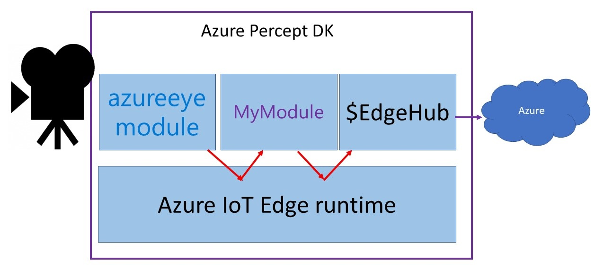

# Processing Azure Percept DK inferencing data
In the default set-up of the Azure DK, the camera module inferencing output is directly sent to IoT Hub, as shown in the following image.

The responsible of this behaviour are the routes on the IoT Edge device defined in the IoT Hub instance serving this DK.

In this set-up, we are going to add an IoT Edge module that process this data in the device itself, before sending it over to the cloud, as shown here:

