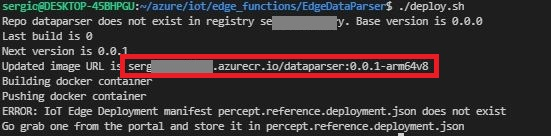

# Processing Azure Percept DK inferencing data
In the default set-up of the Azure DK, the camera module inferencing output is directly sent to IoT Hub, as shown in the following image.


The responsible of this behaviour are the routes on the IoT Edge device defined in the IoT Hub instance serving this DK.

In this lab, we are going to add an IoT Edge module that process this data in the device itself, before sending it over to the cloud, as shown here:


We are going to use Azure CLI and code a simple module in Python. Certainly other choices are possible, but this are my preferences :)
You also need a docker runtime in your PC. I recommend WSL if you are a Windows user

## Add the configuration of your environment
In your favorite editor of choice, edit the following variables shown empty in config.sh:


Just to clarify:
- registry_name = The name of your ACR (Azure Container Registry) instance
- device_name = The name of the AzPercept DK in your IoT Hub

## Build the container and push it to ACR for the first time
The script is considering the initial states, when certain items required are missing. The first thing we need is having this module in an ACR instance, so IoT Hub can connect to.
We run the script:
```
./deploy.sh
```


The script produces an error after the container has been pushed, but this is expected in the first iteration. Now the image is uploaded to our ACR instance:


## Deploy the container to Azure Percept for the first time
Once the module is running and the routes are properly defined, the module can be updated automatically with the provided script.


### Add ACR credentials to IoT Edge Configuration
As shown in the previous image, highlighted in red, you need to provide ACR credentials. For this, go to your ACR instance, under **Settings > Access Keys**, Enable **Admin user** and copy the fields **Login server, username and password** to the fields highlighted in red. If you do not do this, you might configure the module, it will deploy, but your edge device will fail to download and the module will be shown as a crashed container on your AzPercept DK IoT Edge runtime.

### Deploy the module you pushed to ACR on your AzPercept DK
Select the option **Add > IoT Edge Module** highlighed in green in the previous image. The following blade will open and the module name and image URL in ACR must be input.


In order to let the automation script work, please use the name **dataparser**. The image URL was shown when the container was pushed to ACR for the first time, highlighted in red

### Update IoT Edge routes
Now we need to update module routes, so the inference output goes to our module. For this, go to **Routes** option in the blade where you input ACR credentials.


We defined the following routes.

| Name  | Value |
| ------------- | ------------- |
| AzureEyeModuleToParser  | FROM /messages/modules/azureeyemodule/outputs/* INTO BrokeredEndpoint("/modules/dataparser/inputs/input2")  |
| ParserToIoTHub  | FROM /messages/modules/dataparser/outputs/* INTO $upstream  |
| AzureSpeechToIoTHub  | FROM /messages/modules/azureearspeechclientmodule/outputs/* INTO $upstream  |

### Grab the deployment manifest
Once the routes have been defined, there is a deployment manifest ready to use. 


Create a file named **percept.reference.deployment.json** and copy the content of this JSON in the previous image to this file:
```
touch percept.reference.deployment.json
```
Click on **Create** in order to send the deployment to the DK. 

### Verify it is working

The easiest method to see everything working is looking at the telemetry sent to IoT Hub. With the changes provided, the telemetry should now come from our custom module. Use the command **az iot hub monitor-events** pointing to your IoT Hub and Azure Percept DK device name, as shown below.


As you can see highlighted in yellow, now the telemetry comes from a module called **dataparser** and the payload is a simpler JSON format.

## Continuous deployment
With the deployment manifest properly stored, now we can easily make changes to the script and push it to the device with a single script. This is very useful for fine tunning the data manipulation process. 

In this example, we are going to change the message output to something basic hardcoded, that I hope it will indicate how easy it is to modify the script behaviour.

In the previous image, shown in yellow, I commented out the desired line and put a copy with a fixed message.
Then, as shown in orange, I launch the script, pushing a new version of the container image to ACR and deploying the manifest with the updated version to the AzPercept DK.

A few seconds later, in the AzPercept DK we can see the updated version of the container image.
Then, we see in IoT Hub the modified messages arriving.


## Conclusion
Although this lab does not pretent to be a formal CI/CD environment, it provides a basic foundation for automated deployments in AzPercept DKs or any other IoT Edge powered device. For this, the only items of this repo to modify are:

| File  | Required change |
| ------------- | ------------- |
| config.sh  | Update your ACR, IoT Hub and IoT Edge device data  |
| percept.reference.deployment.json  | Create an initial manual deployment of the container image and set the IoT edge routes on IoT hub and copy the resulting manifest  |
