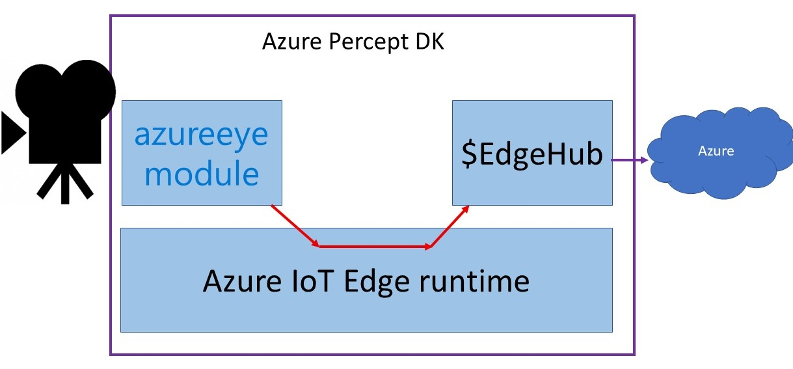

# Processing Azure Percept DK inferencing data
In the default set-up of the Azure DK, the camera module inferencing output is directly sent to IoT Hub, as shown in the following image.

The responsible of this behaviour are the routes on the IoT Edge device defined in the IoT Hub instance serving this DK.

In this lab, we are going to add an IoT Edge module that process this data in the device itself, before sending it over to the cloud, as shown here:

We are going to use Azure CLI and code a simple module in Python. Certainly other choices are possible, but this are my preferences :)

## Add the configuration of your environment
In your favorite editor of choice, edit the following variables shown empty in config.sh:

- registry_name = The name of your ACR instance
- device_name = The name of the AzPercept DK in your IoT Hub
